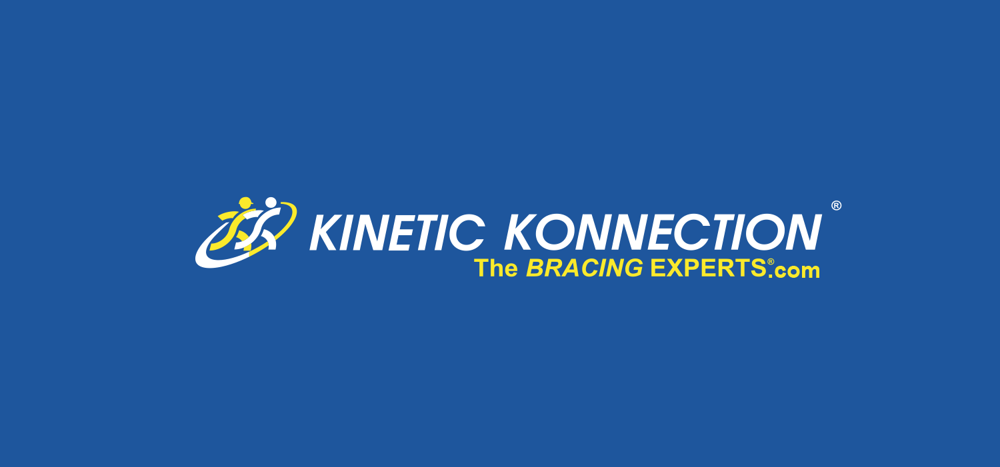

##### Job Description

-   Understood the diagnosis of varying injuries and informed the client about the injuries.
-   Taught coping techniques, and strategies for everyday rehabiliation
-   Provided options to manage and prevent reoccurring pains with bracing and therapy accessories.
-   Found the best treatment solution for the client
-   Checked for insurance and completed the billing process.

###### Employment

-   August 2015 - October 2017
