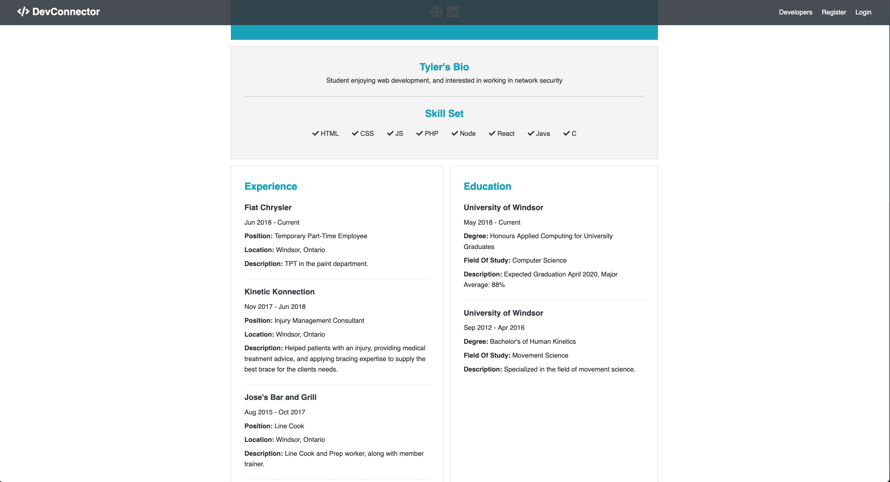
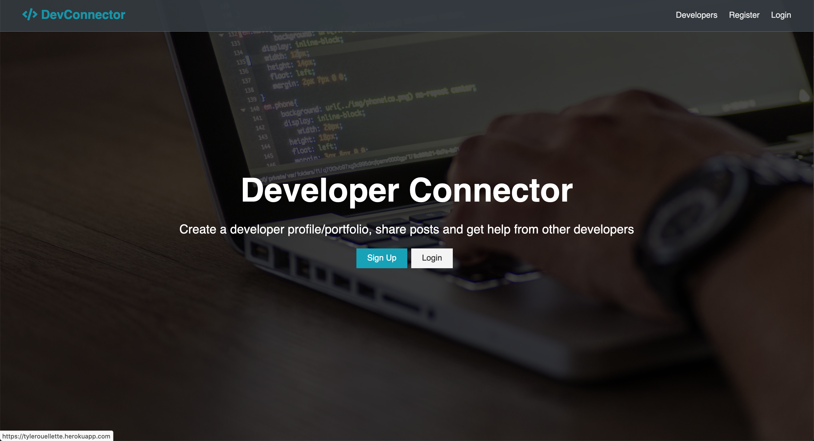
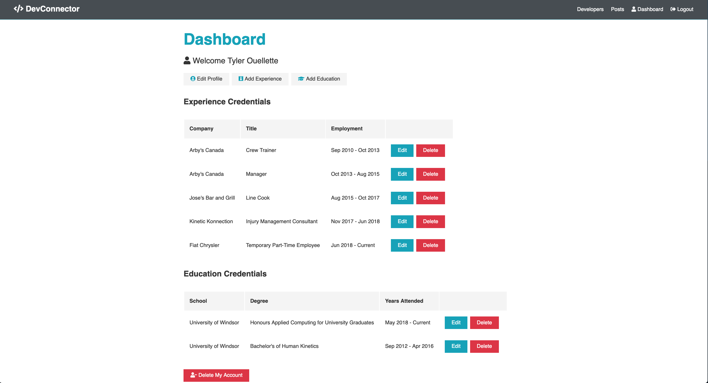
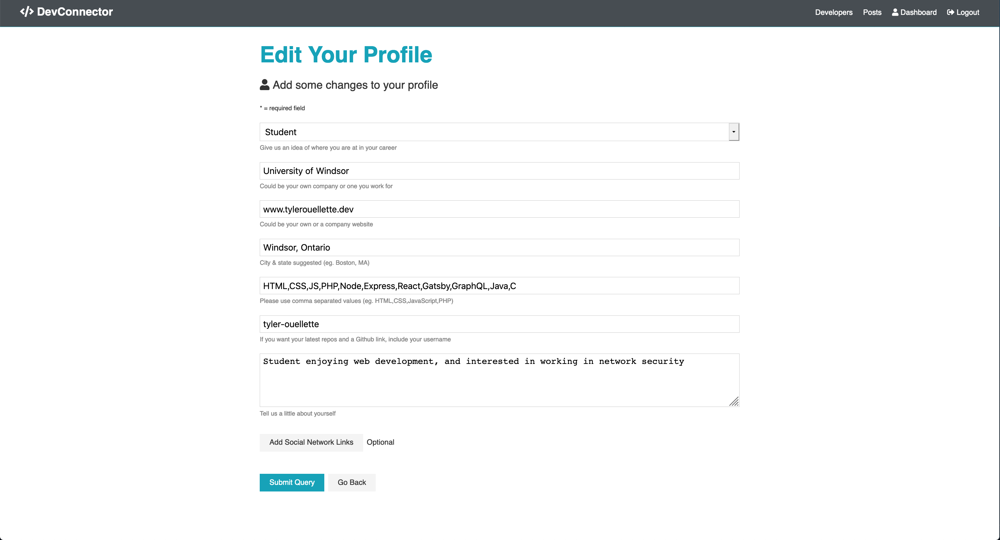
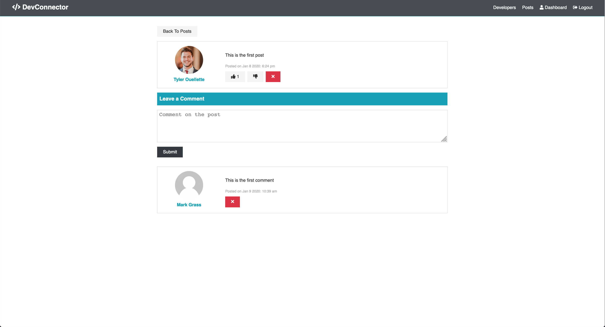

DevConnector is a social media platform designed for developers to create a portfolio, share posts and get help from other developers. The design behind the website to be similar with linkedIn, but specifically designed for devlopers. DevConnector is built using the MERN stack.

[row][col]

User Profile Header

[/col][col]

User Profile Content

[/col][/row]

[row][col]

This is the home page.

[/col][/row]

[row][col]

User Profile Dashboard

[/col][col]

Edit your profile page.

[/col][col]

Posts page

[/col][/row]
