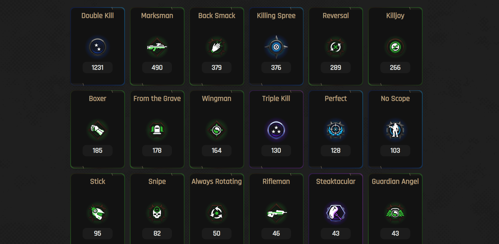

Halo Medals was a personal project started when Halo Infinite was released. I loved the game, and love earning medals in game. The problem being, the game itself doesn't ever display my total amount of medals. I found a way to get the data and created my own initial version to get my medals. After showing it off to friends, they asked if they could use it too. So I redesigned it, allowed users to search for their Gamertag and published it. It has had many interations which now includes more than just medals, but stats, match history, and Service Record. The website is built with Node, Express, React.

[row][col]

View your Rank, Filter by Best All Time, Best this Season, Current Rank. Filter options to filter medals by Rarity and Type. Decide whether you want to show only the medals you own, also show the ones you don't own, or show none.

[/col][/row]

[row][col]

Medals are sorted by count, most to least by default.

[/col][/row]

[row][col]

Sort by Rarity - Mythic

[/col][/row]

[row][col]

Sort by Rarity - Legendary

[/col][/row]

[row][col]

Sort by Type of Medal - Spree

[row][col]

Match History Page, by default it loads your last 25 matches. Use the Load more button to load more, filter by GameMode, Map, Playlist.
[/col][/row]

[row][col]

Filtered Down 125 Matches to show only Ranked Slayer matches on Aquarius. Click the View Match Details button to view futher details of the match rather than just your personal summary.
[/col][/row]

[row][col]

A section that highlights which team had the advantage in each category.
[/col][/row]

[row][col]

The in-game scoreboard look and feel with animations to match in game and filters to toggle the chart based on the category you want to review.
[/col][/row]

[row][col]

Reviewing the Kills category of the scoreboard. Click on a player to view the Player Recap.
[/col][/row]

[row][col]

Reviewing the Player Recap.
[/col][/row]