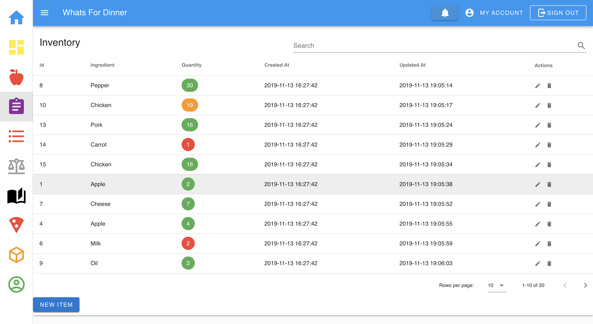
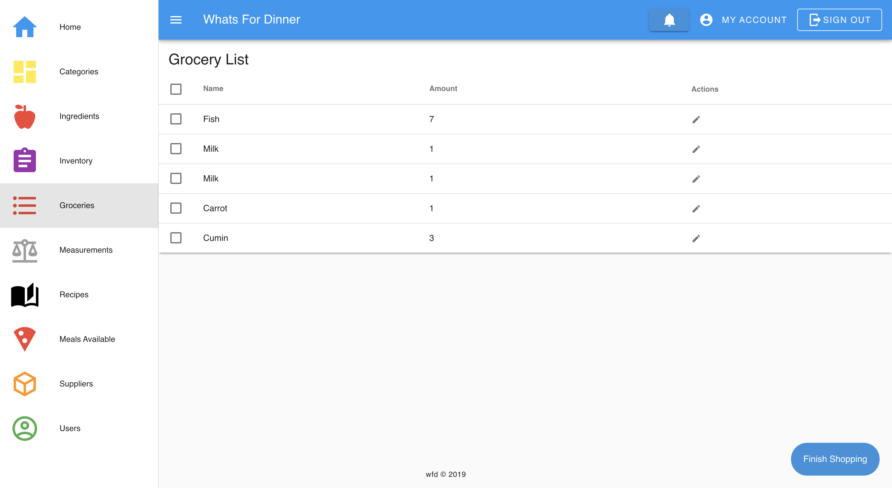
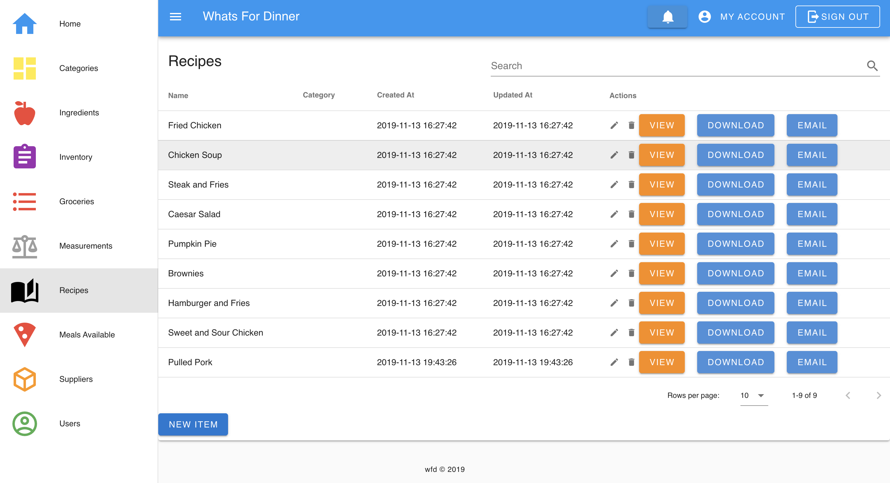
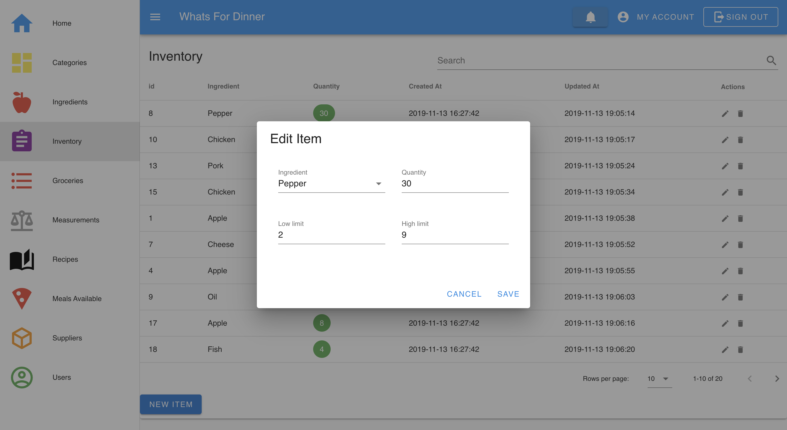

Whats for Dinner is designed to be an inventory management system for a restaurant. This was a group project for our agile class. The idea behind it is for tracking ingredients within their inventory, and creating limits to monitor those values. Once the limit threshold is reached, the ingredient that is low is then added to the grocery list automatically. Further functionality was planned on being added for that when an item was considered to be too high and needs to be used it would generate recipes that can be made that use that ingredient. This was scrapped as we were approaching the end of the class and our group never continued working on the project. The website is built with Laravel and Vue, along with Vuetify component library.

[row][col]

This is the inventory page.

[/col][/row]

[row][col]

This is the grocery List

[/col][/row]

[row][col]

User Profile Content

[/col][/row]

[row][col]

Edit Item

[/col][/row]
